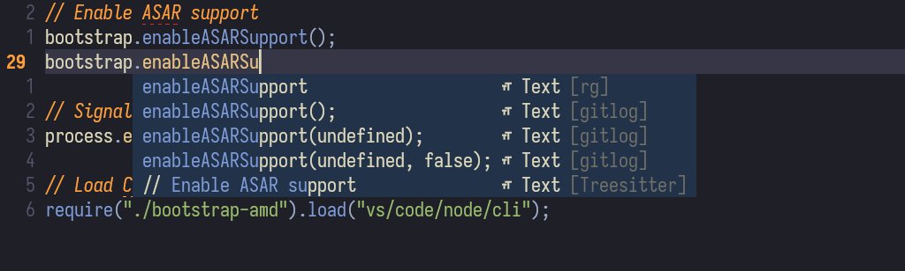

# cmp-gitlog

Suggest completions based on git file history (`git log -p <current_file>`) for [nvim-cmp](https://github.com/hrsh7th/nvim-cmp).
**Based on [lukas-reineke/cmp-rg](https://github.com/lukas-reineke/cmp-rg).**



## Requirements

- Linux or MacOS
- [ripgrep](https://github.com/BurntSushi/ripgrep)
- Neovim 0.7.0+ and [nvim-cmp](https://github.com/hrsh7th/nvim-cmp)

## Installation

Example via [packer](https://github.com/wbthomason/packer.nvim):

```lua
use("barklan/cmp-gitlog")
```

## Setup

Add `gitlog` to your cmp sources:

```lua
require("cmp").setup({
    sources = {
        { name = "gitlog", max_item_count = 5 },
    }
})
```
